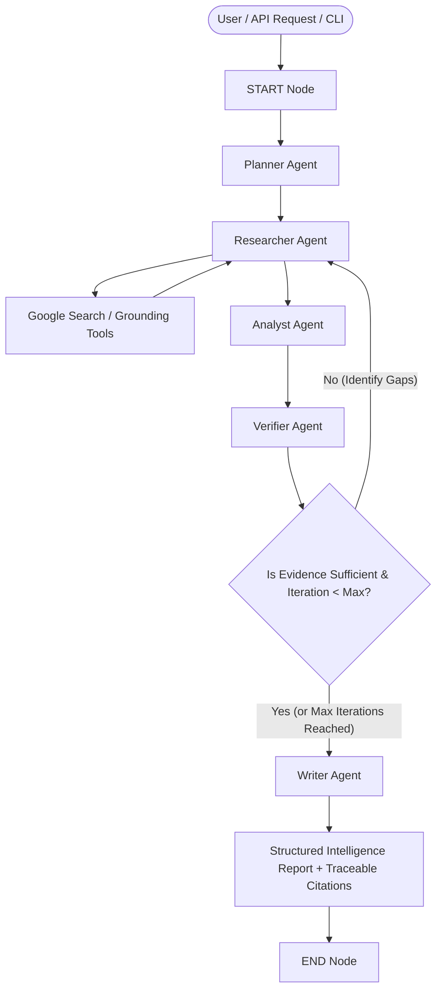

<<<<<<< HEAD
# Autonomous Research Agent

[](https://www.python.org/downloads/)
[](https://github.com/langchain-ai/langgraph)
[](https://ai.google.dev/)
[](https://fastapi.tiangolo.com/)
[](https://opensource.org/licenses/MIT)

A production-grade, multi-agent autonomous research system built with **Google Gemini**, **LangGraph**, and **FastAPI**. The system transforms complex research objectives into structured investigations, autonomously queries the web, collects and deduplicates empirical evidence, verifies fact sufficiency via feedback loops, and synthesizes executive intelligence reports with verifiable citations.

---

## 🏛️ Architecture Overview

The system uses a **State-Machine Multi-Agent Architecture** orchestrated with **LangGraph**. Rather than relying on simple linear LLM chains, specialized agents collaborate through a typed shared state with self-correcting verification loops.



---

## 🤖 Specialized Agent Roles

| Agent | Responsibility | Core Outputs |
| :--- | :--- | :--- |
| **Research Planner** | Decomposes high-level questions into granular subquestions and targeted queries. | `ResearchPlan` (subquestions, search queries, priority levels) |
| **Web Researcher** | Executes grounded web searches, extracts authoritative snippets, and deduplicates sources. | `List[SourceMetadata]`, `List[EvidenceItem]` |
| **Evidence Analyst** | Performs analytical synthesis, detects patterns, resolves contradictions, and categorizes findings. | `SynthesizedAnalysis` (themes, entities, opportunities, risks) |
| **Research Verifier** | Rigorously checks evidence sufficiency, fact grounding, and triggers loopback if gaps remain. | `VerificationResult` (is_sufficient, confidence, missing topics) |
| **Report Writer** | Compiles verified facts into an executive report with numbered citations and sources. | `FinalReport` (executive summary, markdown report, bibliography) |

---

## 🔄 The Autonomous Research Loop

1. **Planning Phase**: The user's research request is ingested and converted into an actionable multi-angle research strategy.
2. **Execution & Evidence Extraction**: Targeted web queries are executed using Gemini's Google Search grounding. Grounding chunks, URLs, titles, and snippets are converted into structured `SourceMetadata` and `EvidenceItem` objects.
3. **Analytical Synthesis**: Evidence is analyzed to identify major institutional entities, market trends, technological frameworks, strategic opportunities, and structural bottlenecks.
4. **Verification & Self-Healing Loop**: The **Verifier Agent** audits whether all subquestions are thoroughly answered. If key topics lack empirical backing and the iteration count is under `MAX_RESEARCH_ITERATIONS`, it formulates targeted follow-up queries and routes execution back to the **Researcher Agent**.
5. **Report Compilation**: Once sufficiency is certified (or the iteration ceiling is reached), the **Writer Agent** produces a comprehensive, publication-ready markdown report with traceable citations `[1]`, `[2]`.

---

## 📂 Project Structure

```
autonomous-research-agent/
│
├── src/
│   ├── __init__.py
│   ├── main.py                     # Unified CLI and FastAPI server entrypoint
│   │
│   ├── config/                     # Settings & environment variable configuration
│   │   ├── __init__.py
│   │   └── settings.py
│   │
│   ├── schemas/                    # Strongly-typed Pydantic schemas
│   │   ├── __init__.py
│   │   ├── research.py             # Plans, subquestions, queries, verification
│   │   ├── evidence.py             # Sources, evidence items, collections
│   │   └── report.py               # Final reports, citations, API payloads
│   │
│   ├── tools/                      # Search tools & helper utilities
│   │   ├── __init__.py
│   │   ├── web_search.py           # Grounded Google Search tool
│   │   └── tools.py                # Arithmetic & datetime tools
│   │
│   ├── agents/                     # Specialized LLM agents
│   │   ├── __init__.py
│   │   ├── base.py                 # Base agent with retry & fallback models
│   │   ├── planner.py              # Research Planner Agent
│   │   ├── researcher.py           # Web Research Agent
│   │   ├── analyst.py              # Evidence Analyst Agent
│   │   ├── verifier.py             # Verification & Audit Agent
│   │   └── writer.py               # Report Writer Agent
│   │
│   ├── graph/                      # LangGraph state machine & workflow
│   │   ├── __init__.py
│   │   ├── state.py                # Strongly typed ResearchState
│   │   └── workflow.py             # Graph nodes, conditional edges, router
│   │
│   ├── services/                   # High-level research orchestrator
│   │   ├── __init__.py
│   │   └── research_service.py
│   │
│   ├── api/                        # FastAPI REST application
│   │   ├── __init__.py
│   │   └── routes.py
│   │
│   ├── evaluation/                 # Benchmark evaluation framework
│   │   ├── __init__.py
│   │   ├── dataset.py              # Curated research test cases
│   │   └── evaluator.py            # Automated metrics & evaluator
│   │
│   └── utils/                      # Logging & string parsing helpers
│       ├── __init__.py
│       ├── logging.py
│       └── helpers.py
│
├── tests/                          # 28+ unit and integration tests
│   ├── __init__.py
│   ├── test_schemas.py
│   ├── test_tools.py
│   ├── test_agents.py
│   ├── test_workflow.py
│   ├── test_api.py
│   └── test_evaluation.py
│
├── .env.example                    # Documented configuration template
├── .gitignore                      # Clean repository ignore rules
├── Dockerfile                      # Production container image
├── docker-compose.yml              # Local container deployment
├── pyproject.toml                  # Project packaging & pytest config
├── requirements.txt                # Production dependencies
└── README.md                       # Documentation
```

---

## 🚀 Quick Start

### 1. Prerequisites

- Python 3.10 or higher
- A Google Gemini API Key (Get one from [Google AI Studio](https://aistudio.google.com/))

### 2. Installation

Clone the repository and create a virtual environment:

```powershell
git clone https://github.com/your-username/autonomous-research-agent.git
cd autonomous-research-agent

python -m venv .venv
.venv\Scripts\Activate.ps1   # On Windows
# source .venv/bin/activate  # On Linux/macOS

pip install -r requirements.txt
```

### 3. Environment Configuration

Copy the example environment configuration:

```powershell
cp .env.example .env
```

Edit `.env` and insert your Gemini API Key:

```env
GEMINI_API_KEY=your_gemini_api_key_here
GEMINI_MODEL=gemini-3.5-flash-lite
FALLBACK_MODELS=gemini-3.6-flash,gemini-flash-latest,gemini-2.5-flash
MAX_RESEARCH_ITERATIONS=3
```

---

## 💻 Usage Modes

### Mode 1: Interactive CLI

Run research directly in your terminal:

```powershell
# Interactive prompt
python src/main.py

# Command-line query argument
python src/main.py --question "Analyze the AI automation market in Saudi Arabia"

# Save generated report to a markdown file
python src/main.py --question "Quantum Computing in Financial Portfolio Optimization" --output report.md

# Run in offline mock mode (for fast testing)
python src/main.py --question "Autonomous Agents in DevOps" --mock
```

### Mode 2: FastAPI REST Server

Start the production backend server:

```powershell
python src/main.py --serve --port 8000
```

Access API Documentation:
- Swagger UI: [http://localhost:8000/docs](http://localhost:8000/docs)
- OpenAPI Spec: [http://localhost:8000/openapi.json](http://localhost:8000/openapi.json)

#### Example API Request

```bash
curl -X POST "http://localhost:8000/research" \
     -H "Content-Type: application/json" \
     -d '{
       "question": "Analyze the AI automation market in Saudi Arabia.",
       "max_iterations": 2
     }'
```

#### Example API Response

```json
{
  "status": "success",
  "question": "Analyze the AI automation market in Saudi Arabia.",
  "report": {
    "title": "Strategic Intelligence Report: AI Automation Market in Saudi Arabia",
    "executive_summary": "...",
    "research_objective": "...",
    "key_findings": [
      "National strategy and sovereign investment funds are accelerating automated AI infrastructure deployment [1].",
      "Enterprise adoption is transitioning rapidly from conversational interfaces to multi-agent workflow systems [2]."
    ],
    "sections": [...],
    "companies_entities": [...],
    "technologies": [...],
    "opportunities": [...],
    "risks_challenges": [...],
    "market_trends": [...],
    "recommendations": [...],
    "limitations": [...],
    "sources": [
      {
        "id": "src_1",
        "title": "Authoritative Insights on Saudi AI",
        "url": "https://www.spa.gov.sa/article/...",
        "domain": "spa.gov.sa",
        "source_type": "official_government",
        "reliability_score": 0.95
      }
    ],
    "full_markdown": "# Strategic Intelligence Report..."
  },
  "sources_count": 5,
  "evidence_count": 18,
  "metadata": {
    "duration_seconds": 12.4,
    "iterations": 2,
    "primary_model": "gemini-3.5-flash-lite",
    "verification_confidence": 0.92
  }
}
```

---

## 🐳 Docker Deployment

Run the system containerized using Docker Compose:

```powershell
docker-compose up --build -d
```

Check service health:

```powershell
curl http://localhost:8000/health
```

---

## 🧪 Testing Suite

The repository includes a comprehensive `pytest` test suite verifying all schemas, agents, tools, routing logic, and API endpoints:

```powershell
pytest -v
```

### Test Coverage Breakdown

- `test_schemas.py`: Validation, serialization, constraints, and edge cases.
- `test_tools.py`: Search grounding parsing, reliability scoring, URL domain classification.
- `test_agents.py`: Isolated agent reasoning, structured output parsing, error handling.
- `test_workflow.py`: LangGraph state machine, conditional routing, max iteration safeguards.
- `test_api.py`: FastAPI endpoints (`/health`, `/models`, `/research`), validation error handling.
- `test_evaluation.py`: Metric calculation for completeness, citations, and source quality.

---

## 📊 Benchmark Evaluation Framework

The project features a built-in evaluation framework to benchmark research completeness, source authority, and citation fidelity:

```powershell
python -m src.evaluation.evaluator
```

### Benchmark Metrics

| Metric | Description | Target |
| :--- | :--- | :--- |
| **Completeness Score** | Percentage of required analytical sections and depth criteria satisfied. | `> 0.85` |
| **Source Quality Score** | Average reliability score of cited domains (government, academic, reputable news). | `> 0.80` |
| **Citation Coverage** | Ratio of core claims backed by inline numerical citations `[n]`. | `> 0.90` |
| **Verification Loop Fidelity** | Ability of the Verifier Agent to catch omissions and trigger follow-up queries. | `100%` |

---

## 🛡️ Resilience & Production Engineering

1. **Automatic Model Fallback**: If the primary Gemini model encounters rate limits (`429 RESOURCE_EXHAUSTED`) or temporary service unavailability (`503 UNAVAILABLE`), the agent automatically fails over across configured fallback models (`gemini-3.6-flash`, `gemini-flash-latest`, `gemini-2.5-flash`).
2. **Exponential Backoff**: Integrated `tenacity` retry logic ensures graceful recovery from transient network errors.
3. **Structured Output Self-Healing**: If strict JSON schema parsing fails, the agent initiates a targeted schema-repair prompt to extract clean JSON.
4. **Infinite Loop Prevention**: Configurable `MAX_RESEARCH_ITERATIONS` ceiling guarantees the graph terminates with actionable findings.
5. **Full Observability**: Structured colorized logging captures every agent decision, source discovery, and verification verdict without logging API keys or sensitive data.

---

## 📄 License

This project is licensed under the MIT License — see the [LICENSE](LICENSE) file for details.
=======
# autonomous-research-agent
>>>>>>> 99b41aec2adf1913cb4892142fad1e0440ce6aff
